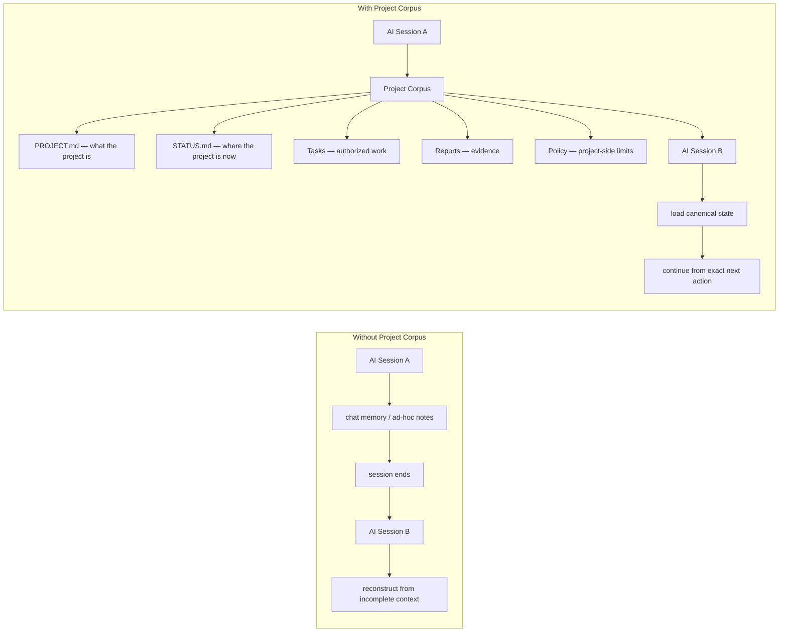

# Project Corpus

[Русская версия](README.ru.md)

**Persistent project state and authority for AI agents.**

Project Corpus is a Markdown-first, vendor-neutral protocol that lets ChatGPT,
Codex, Claude, and other AI agents resume a project from clean context without
relying on chat memory.

It records the project's canonical identity, current state, evidence, exact
next action, and authority boundaries in files that remain available when an
AI session ends. The [Protocol](protocol/v2/README.md) needs only Markdown; the
[optional Runtime](docs/runtime/cli.md) adds technical enforcement.



> AI sessions are disposable. Project state is not.

## More than a memory bank

A memory bank helps an agent remember information. Project Corpus additionally
defines what is canonical, what is current, what counts as evidence, what comes
next, and who may change state.

## 60-second Quick Start

No Runtime, MCP server, or package installation is required.

1. Download or clone this repository.
2. Copy the contents of [`templates/v2/minimal/`](templates/v2/minimal/) into
   the root of your project. From a repository checkout:

   macOS/Linux:

   ```sh
   cp -R templates/v2/minimal/. /path/to/your-project/
   ```

   PowerShell:

   ```powershell
   Copy-Item -Force .\templates\v2\minimal\AGENTS.md C:\path\to\your-project\
   Copy-Item -Recurse -Force .\templates\v2\minimal\.project-corpus C:\path\to\your-project\
   ```

3. Fill in [`.project-corpus/state/PROJECT.md`](templates/v2/minimal/.project-corpus/state/PROJECT.md)
   with the project ID and durable project identity.
4. Fill in [`.project-corpus/state/STATUS.md`](templates/v2/minimal/.project-corpus/state/STATUS.md)
   with the same project ID, verified baseline, blockers, evidence references,
   and exact next action.
5. Give ChatGPT, Codex, Claude, or another agent access to the project folder.
   In a manual chat, upload `AGENTS.md`, `PROJECT.md`, and `STATUS.md`. Then say:

   > Load Project Corpus for this project. Follow `AGENTS.md`; read
   > `.project-corpus/state/PROJECT.md` and
   > `.project-corpus/state/STATUS.md` completely; load only the active Task
   > and cited Reports; state the project ID, current status, active Task, and
   > exact next action; then continue from that action.

### Want enforcement too?

The optional Runtime is currently installed from a local clone, not from PyPI:

```sh
git clone https://github.com/darksleep1983/project-corpus.git
cd project-corpus
python -m pip install .
project-corpus validate /path/to/your-project
project-corpus doctor /path/to/your-project
```

It adds validation/doctor, external owner trust, policy enforcement,
expected-hash transactions, audit/recovery, and optional local stdio MCP.
Controlled writes require an external owner trust grant; follow the
[Runtime CLI guide](docs/runtime/cli.md) rather than treating project content as
authority.

## Protocol and Runtime

| Project Corpus Protocol | Optional Project Corpus Runtime |
| --- | --- |
| Markdown-first and vendor-neutral | Validation and controlled CLI |
| No installation or database | External owner trust and policy enforcement |
| Manual workflow supported | Verified writes and audit/recovery |
| MCP optional | Optional local stdio MCP |

The Protocol is the portable product contract. The Runtime implements it but
does not define or silently amend it. Enforced guarantees apply only in
controlled modes on the qualified local filesystems listed in the
[platform matrix](docs/security/platform-guarantees.md).

## Maintained V1 workflow

The original V1 workflow remains available for existing projects. Its template
contains:

```text
AGENTS.md
OPERATOR_PROFILE.md
PROJECT_ROADMAP_CURRENT.md
CORPUS_ACCESS_CURRENT.md
LOADER_PROMPT_CURRENT.md
SESSION_HANDOFF_CURRENT.md
SESSION_HANDOFF_FULL_CURRENT.md
Tasks/
Report/
```

`AGENTS.md` defines the rules. The roadmap and handoffs preserve current state.
`Tasks/` contains scoped work orders; `Report/` contains evidence of completed
work.

## Choose one V1 access mode

| Mode | Best for | What happens |
| --- | --- | --- |
| Direct folder | Codex, Claude Code, ChatGPT Work, and other local agents | Give the client access only to the Corpus folder and let it read or update the files directly. |
| Your own MCP | Clients that support an MCP server or file connector | Connect a trusted server of your choice, restrict it to the Corpus root, and record its real capabilities. |
| Manual session | Any AI chat, with no setup | Upload the seven current files at the start; at the end, save only the replacement files the AI returns. |

The three modes use the same protocol. An unavailable MCP server is not a
blocker: switch to direct-folder or manual access.

Read the detailed guides:

- [Direct folder](docs/access/direct-folder.md)
- [Your own MCP](docs/access/own-mcp.md)
- [Manual sessions](docs/access/manual.md)

## V1 five-minute start

1. Download or clone this repository.
2. Copy one language folder to a safe location and name it `Corpus`:
   - `template/en` for English;
   - `template/ru` for Russian.
3. Open `CORPUS_ACCESS_CURRENT.md` and choose an access mode.
4. Give your AI the matching text from
   [`PROJECT_INSTRUCTION_TEMPLATE.md`](PROJECT_INSTRUCTION_TEMPLATE.md).
5. Say what you want to build in normal language.

Example:

> Start a new project. I want to build a local photo organizer. First help me
> define the architecture. Do not install, delete, publish, or contact anyone.

## Client guides

- [ChatGPT](docs/clients/chatgpt.md)
- [Codex](docs/clients/codex.md)
- [Claude Code](docs/clients/claude-code.md)
- [Claude Desktop](docs/clients/claude-desktop.md)
- [Other AI clients](docs/clients/other-clients.md)

Client interfaces and plan availability can change. Each guide keeps volatile
client setup separate from the stable Corpus protocol and links to official
documentation.

## V1 manual mode really works

If you do not want to configure local folders or MCP:

1. upload the seven current files in a new session;
2. upload only the Tasks and Reports relevant to the request;
3. ask the AI to read `AGENTS.md` first and issue a loading receipt;
4. work normally;
5. ask for a manual synchronization package;
6. back up the old local files and save the returned replacements.

Ordinary synchronization must not rewrite `AGENTS.md` or
`OPERATOR_PROFILE.md`. The AI should return only files that actually changed and
must not claim that it saved them on your computer.

## Important limits

- Project Corpus is a documentation protocol, not a security sandbox.
- Real access is controlled by your AI client, filesystem permissions, or your
  chosen MCP server.
- V1 direct-folder and manual workflows do not gain Runtime enforcement.
- The optional V2 Runtime provides local CLI and stdio MCP only; it does not
  provide HTTP/remote MCP or audit third-party servers.
- A saved Report is not proof that a service or external system is currently
  healthy.
- Do not store passwords, tokens, cookies, seed phrases, or API keys in the
  Corpus.
- Keep one active project per Corpus.

More: [how it works](docs/how-it-works.md), [FAQ](docs/faq.md),
[security model](docs/security.md), [languages](docs/languages.md), and
[moving or removing a Corpus](docs/uninstall.md).

## Current status

Project Corpus V2 is the current open-source generation. The bilingual
templates, three access modes, documentation links, repository integrity and
optional Runtime are checked automatically. Release changes are recorded in
the [changelog](CHANGELOG.md).

## Feedback

Use [GitHub Issues](https://github.com/darksleep1983/project-corpus/issues) for
bugs, setup questions, and improvement ideas. Do not post secrets or private
Corpus contents.

## Support the project

Project Corpus is free and MIT-licensed. Voluntary support is available through
USDT on TON; see the [support page and wallet address](SUPPORT.md). A donation is
not a purchase and does not provide additional rights or guarantees.

## License

MIT. See [LICENSE](LICENSE).
