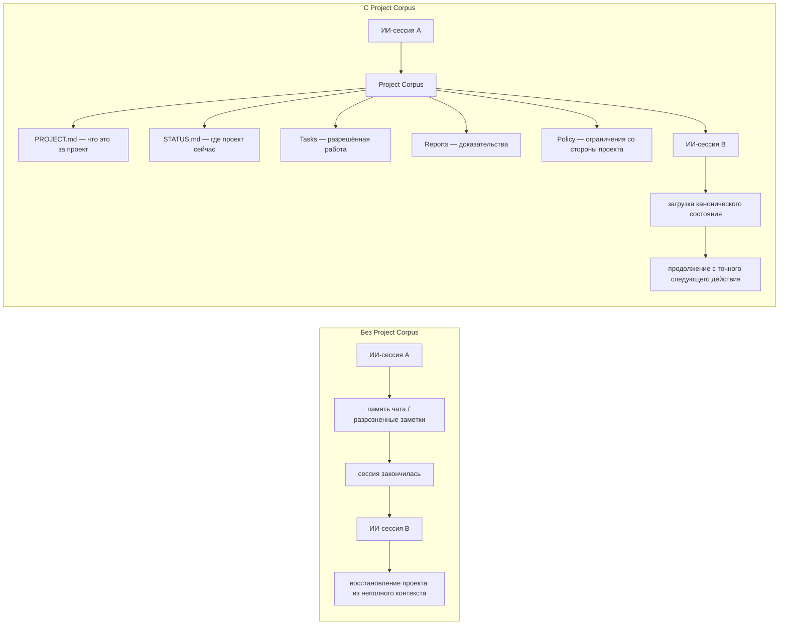

# Project Corpus

[English](README.md)

**Постоянное состояние проекта и слой полномочий для ИИ-агентов.**

Project Corpus — Markdown-first, независимый от конкретного ИИ протокол. Он
позволяет ChatGPT, Codex, Claude и другим агентам входить в проект с чистого
контекста и продолжать работу, не полагаясь на память предыдущего чата.

Каноническая идентичность проекта, текущее состояние, доказательства, точное
следующее действие и границы полномочий сохраняются в файлах и не исчезают
вместе с ИИ-сессией. [Protocol](protocol/v2/README.md) требует только Markdown;
[необязательный Runtime](docs/runtime/cli.md) добавляет технический enforcement.



> ИИ-сессии временны. Состояние проекта — нет.

## Больше, чем memory bank

Memory bank помогает агенту помнить информацию. Project Corpus дополнительно
определяет, что канонично, что актуально, что считается доказательством, что
делать дальше и кто вправе менять состояние.

## Быстрый старт за 60 секунд

Runtime, MCP-сервер и установка пакета не нужны.

1. Скачайте или клонируйте этот репозиторий.
2. Скопируйте содержимое
   [`templates/v2/minimal/`](templates/v2/minimal/) в корень своего проекта.
   Из локальной копии репозитория:

   macOS/Linux:

   ```sh
   cp -R templates/v2/minimal/. /path/to/your-project/
   ```

   PowerShell:

   ```powershell
   Copy-Item -Force .\templates\v2\minimal\AGENTS.md C:\path\to\your-project\
   Copy-Item -Recurse -Force .\templates\v2\minimal\.project-corpus C:\path\to\your-project\
   ```

3. Заполните [`.project-corpus/state/PROJECT.md`](templates/v2/minimal/.project-corpus/state/PROJECT.md):
   укажите ID и долговременную идентичность проекта.
4. Заполните [`.project-corpus/state/STATUS.md`](templates/v2/minimal/.project-corpus/state/STATUS.md):
   укажите тот же ID, проверенный baseline, блокеры, ссылки на evidence и
   точное следующее действие.
5. Дайте ChatGPT, Codex, Claude или другому агенту доступ к папке проекта. В
   обычный чат загрузите `AGENTS.md`, `PROJECT.md` и `STATUS.md`. Затем напишите:

   > Загрузи Project Corpus этого проекта. Следуй `AGENTS.md`; полностью прочти
   > `.project-corpus/state/PROJECT.md` и
   > `.project-corpus/state/STATUS.md`; загрузи только активную Task и указанные
   > Reports; назови ID проекта, текущий статус, активную Task и точное следующее
   > действие; затем продолжи с этого действия.

### Нужен ещё и enforcement?

Сейчас необязательный Runtime устанавливается из локального клона, а не из
PyPI:

```sh
git clone https://github.com/darksleep1983/project-corpus.git
cd project-corpus
python -m pip install .
project-corpus validate /path/to/your-project
project-corpus doctor /path/to/your-project
```

Он добавляет validation/doctor, внешний owner trust, policy enforcement,
транзакции с expected hash, audit/recovery и необязательный локальный stdio MCP.
Для controlled-записи нужен внешний owner trust grant; используйте
[инструкцию по Runtime CLI](docs/runtime/cli.md), а не содержимое проекта как
источник полномочий.

## Protocol и Runtime

| Project Corpus Protocol | Необязательный Project Corpus Runtime |
| --- | --- |
| Markdown-first и независимый от поставщика ИИ | Validation и controlled CLI |
| Не требует установки или базы данных | Внешний owner trust и policy enforcement |
| Поддерживает ручной workflow | Проверяемые записи и audit/recovery |
| MCP необязателен | Необязательный локальный stdio MCP |

Protocol — переносимый контракт продукта. Runtime реализует его, но не
определяет и не может молча изменять. Технические гарантии действуют только в
controlled-режимах на проверенных локальных filesystem из
[platform matrix](docs/security/platform-guarantees.md).

## Поддерживаемый workflow V1

Исходный workflow V1 остаётся доступен для существующих проектов. Его шаблон
содержит:

```text
AGENTS.md
OPERATOR_PROFILE.md
PROJECT_ROADMAP_CURRENT.md
CORPUS_ACCESS_CURRENT.md
LOADER_PROMPT_CURRENT.md
SESSION_HANDOFF_CURRENT.md
SESSION_HANDOFF_FULL_CURRENT.md
Tasks/
Report/
```

`AGENTS.md` задаёт правила. Roadmap и handoff-файлы сохраняют текущее состояние.
`Tasks/` содержит ограниченные рабочие задания, а `Report/` — доказательства
выполненной работы.

## Выберите режим доступа V1

| Режим | Для чего подходит | Что происходит |
| --- | --- | --- |
| Прямая папка | Codex, Claude Code, ChatGPT Work и другие локальные агенты | Клиент получает доступ только к папке Corpus и читает или обновляет файлы напрямую. |
| Свой MCP | Клиенты с поддержкой MCP-сервера или файлового connector | Вы подключаете доверенный сервер по своему выбору, ограничиваете его корнем Corpus и записываете его реальные возможности. |
| Ручная сессия | Любой AI-чат без настройки | В начале загружаете семь current-файлов, а в конце сами сохраняете только возвращённые AI замены. |

Во всех трёх режимах действует один протокол. Если MCP недоступен, это не
блокирует работу: используйте прямую папку или ручной режим.

Подробные инструкции:

- [Прямая папка](docs/access/direct-folder.ru.md)
- [Свой MCP](docs/access/own-mcp.ru.md)
- [Ручные сессии](docs/access/manual.ru.md)

## Пятиминутный старт V1

1. Скачайте или клонируйте репозиторий.
2. Скопируйте папку нужного языка в безопасное место и назовите её `Corpus`:
   - `template/ru` для русского;
   - `template/en` для английского.
3. Откройте `CORPUS_ACCESS_CURRENT.md` и выберите режим доступа.
4. Дайте AI подходящий текст из
   [`PROJECT_INSTRUCTION_TEMPLATE.ru.md`](PROJECT_INSTRUCTION_TEMPLATE.ru.md).
5. Обычными словами опишите, что хотите сделать.

Например:

> Начинаем новый проект. Хочу сделать локальный сортировщик фотографий. Сначала
> помоги продумать архитектуру. Пока ничего не устанавливай, не удаляй, не
> публикуй и ни с кем не связывайся.

## Инструкции для клиентов

- [ChatGPT](docs/clients/chatgpt.ru.md)
- [Codex](docs/clients/codex.ru.md)
- [Claude Code](docs/clients/claude-code.ru.md)
- [Claude Desktop](docs/clients/claude-desktop.ru.md)
- [Другие AI-клиенты](docs/clients/other-clients.ru.md)

Интерфейсы клиентов и доступность функций по тарифам могут меняться. Поэтому
изменчивая настройка клиента отделена от стабильного протокола Corpus, а в
инструкциях даны ссылки на официальную документацию.

## Ручной режим V1 действительно работает

Если вы не хотите настраивать локальные папки или MCP:

1. загрузите семь current-файлов в новую сессию;
2. добавьте только нужные для задачи Tasks и Reports;
3. попросите AI сначала прочитать `AGENTS.md` и выдать квитанцию загрузки;
4. работайте как обычно;
5. в конце попросите ручной пакет синхронизации;
6. сохраните старые файлы в backup и запишите возвращённые замены.

При обычной синхронизации нельзя переписывать `AGENTS.md` и
`OPERATOR_PROFILE.md`. AI должен вернуть только реально изменившиеся файлы и
прямо сказать, что не сохранял их на вашем компьютере.

## Важные ограничения

- Project Corpus — протокол работы с документами, а не sandbox безопасности.
- Реальный доступ задают AI-клиент, права файловой системы или выбранный вами
  MCP-сервер.
- V1 direct-folder и manual workflow не получают гарантий Runtime.
- Необязательный V2 Runtime предоставляет только локальный CLI и stdio MCP; в
  нём нет HTTP/remote MCP, и он не проверяет сторонние серверы.
- Сохранённый Report не доказывает, что сервис или внешняя система сейчас
  исправны.
- Не храните в Corpus пароли, токены, cookies, seed-фразы или API-ключи.
- Один Corpus предназначен для одного активного проекта.

Подробнее: [как это работает](docs/how-it-works.ru.md),
[частые вопросы](docs/faq.ru.md), [модель безопасности](docs/security.ru.md),
[языки](docs/languages.ru.md) и [перенос или удаление Corpus](docs/uninstall.ru.md).

## Текущий статус

Project Corpus V2 — текущее поколение open-source проекта. Паритет русского и
английского шаблонов, три режима доступа, ссылки документации, целостность
репозитория и необязательный Runtime проверяются автоматически. Изменения
релизов записываются в [истории изменений](CHANGELOG.ru.md).

## Обратная связь

Используйте [GitHub Issues](https://github.com/darksleep1983/project-corpus/issues)
для сообщений об ошибках, вопросов и предложений. Не публикуйте секреты или
содержимое личного Corpus.

## Поддержать проект

Project Corpus распространяется бесплатно по лицензии MIT. Добровольно поддержать
развитие можно через USDT в сети TON; адрес и подробности находятся на
[странице поддержки](SUPPORT.ru.md). Пожертвование не является покупкой и не
даёт дополнительных прав или гарантий.

## Лицензия

MIT. См. [LICENSE](LICENSE).
