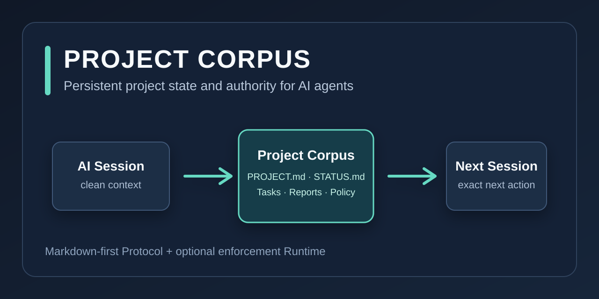

# Project Corpus

**Persistent project state and authority for AI agents.**

AI sessions end; the project should not have to start from scratch. Project
Corpus is a Markdown-first, vendor-neutral protocol that records what a project
is, where it is now, what has been verified, what comes next, and which rules
govern change.

## In 30 seconds

Project Corpus gives an agent durable, inspectable project state instead of
asking it to reconstruct work from chat memory. The Protocol works as ordinary
Markdown with no installation, database, or MCP server. An optional local
Runtime adds validation, external owner trust, policy enforcement, verified
writes, audit/recovery, and a local stdio MCP adapter.

## Start manually

Copy the [V2 minimal template](https://github.com/darksleep1983/project-corpus/tree/main/templates/v2/minimal)
into a project, fill `PROJECT.md` and `STATUS.md`, then give the agent the
project folder or upload the canonical files. The [Quick Start](quickstart.md)
has the exact paths and a ready-to-use loading prompt.

## Choose the layer you need

| Project Corpus Protocol | Optional Project Corpus Runtime |
| --- | --- |
| Markdown-first and vendor-neutral | Controlled CLI and local stdio MCP |
| No installation required | External owner trust and policy enforcement |
| Manual and direct-folder workflows | Verified transactions, audit, and recovery |

The Runtime implements the Protocol; it never silently defines or broadens it.
For security and platform boundaries, start with the [security model](security.md).

## Existing V1 projects

V1 remains supported. The V2 migration path plans changes read-only and creates
a separate V2 destination without rewriting V1 templates. See
[Migration](migration/v1-read-only-planner.md).

The documentation site is an English-first reference. The repository keeps
[Russian documentation](https://github.com/darksleep1983/project-corpus/blob/main/README.ru.md)
alongside English source documentation.
